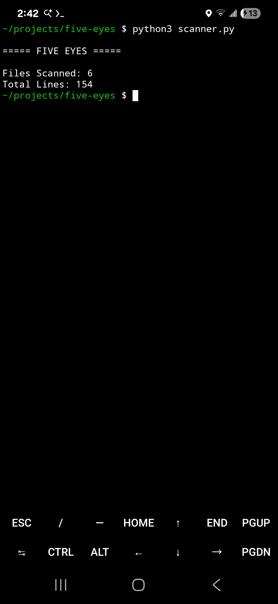

# Five Eyes

Five Eyes is a local-first code review and risk analysis pipeline built around independent reviewers ("Eyes").

Each Eye performs a focused task and passes structured findings forward, allowing code to be analyzed incrementally before requiring human review or larger reasoning systems.

---

# Development Timeline

## v0.0.1 — Architecture Foundation

- Repository established
- Philosophy documented
- Architecture documented
- Roadmap documented

---

## v0.0.2 — Eye One Scanner

- File discovery implemented
- Line counting implemented
- Extension classification implemented
- First executable reviewer released

---

## v0.0.3 — Rule Detection Prototype

- Pattern matching implemented
- Detection patterns added
- First security findings generated

---

## v0.0.4 — Eye One Modular Architecture

Status: Complete

### Achievements

- Reviewer architecture established
- Eye One extracted into independent module
- Scanner converted into orchestration layer
- Foundation established for Eyes Two through Five

### Evidence

Screenshot:

Tag:

#eyeone

Output:

- Files Scanned: 6
- Total Lines: 154

### Lesson Learned

Stable reviewers should be added, not repeatedly rewritten.

New capabilities should arrive as new Eyes rather than continuously modifying existing Eyes.

---

# Current Status

- Eye One: Complete ✓
- Eye Two: Next
- Eye Three: Planned
- Eye Four: Planned
- Eye Five: Planned

---

# Vision

Eye One  -> Structure

Eye Two  -> Rules

Eye Three -> Patterns

Eye Four -> Scoring

Eye Five -> Reporting

Each Eye should be independently testable, independently releasable, and independently understandable.

